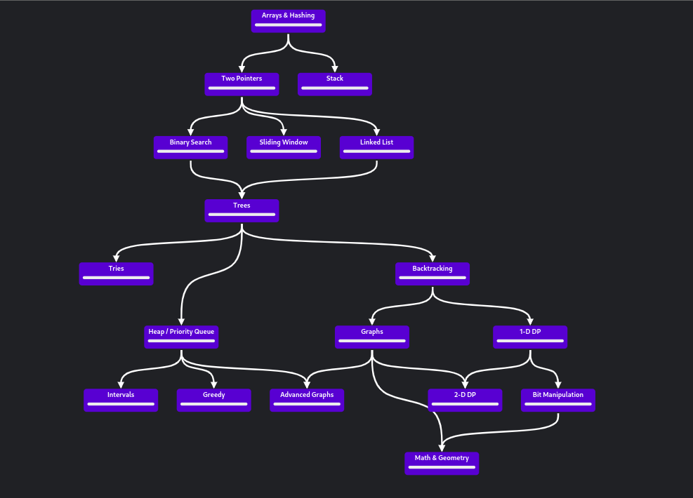

## Data Structures

### Arrays

- Arrays are the simplest form of data structures. They store elements of the same type in contiguous memory locations, allowing for quick access using an index.

### Linked Lists

- Linked lists consist of nodes, where each node contains data and a reference (or link) to the next node in the sequence. Linked lists come in various types:
  - Singly Linked Lists
  - Doubly Linked Lists
  - Circular Linked Lists
  

### Stacks

- Stacks follow the Last-In-First-Out (LIFO) principle. Elements can be pushed onto the stack and popped off the top.

### Queues

- Queues follow the First-In-First-Out (FIFO) principle. Different types of queues include:
  - Linear Queue: Simplest form of a queue, elements are added at the rear and removed from the front.
  - Circular Queue: Similar to linear queue, but the rear loops back to the front, allowing for efficient space utilization.
  - Priority Queue: Elements have associated priorities and are dequeued based on priority.
  - Double-Ended Queue (Deque): Allows insertion and removal from both the front and rear.

### Trees

- Trees are hierarchical structures with a root node and child nodes. Common types include:
  - Binary Trees
  - Binary Search Trees
  - Balanced Trees (e.g., AVL, Red-Black)

### Graphs

- Graphs consist of nodes (vertices) connected by edges. They can be directed or undirected, and can have cycles or be acyclic.

---

## Algorithms

### Sorting Algorithms:

- Understanding sorting algorithms like Bubble Sort, Selection Sort, Insertion Sort, Merge Sort, Quick Sort, and their time complexities is crucial.

### Searching Algorithms:

- Familiarize yourself with Linear Search, Binary Search, and Hashing for efficient data retrieval.

### Recursion:

- Learn how to solve problems using recursion. A classic example is the Fibonacci sequence.

### Dynamic Programming:

- Dynamic programming is a powerful technique for solving problems by breaking them down into smaller sub-problems. The key is to store and reuse solutions to subproblems to avoid redundant computations.

### Graph Algorithms:

- Study Breadth-First Search (BFS) and Depth-First Search (DFS) for traversing graphs. Also, learn about Dijkstra's algorithm for finding the shortest path and Prim's/Kruskal's algorithms for minimum spanning trees.

---

---

## For Arrays and Strings
- Greedy, bin search and 2 pointers, sliding windows, backtracking

## Matrix, Trees and Priority Queues
- BFS, DFS and Recursion

## Graph, Linked-List and Stack
-  Dynamic and monotonic stack and Union Find 

## __Road_Map__

